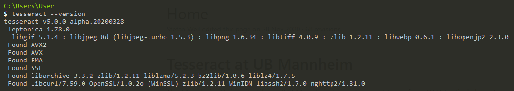

# Scoreboard-Analysis

## Folder Structure
```
+-- DigitsDetection          # yolo confid file and pretrained model for digits detection
+-- DigitsRecognition        # Tesseract OCR
+-- GroundTruth              # GroundTruth for 4 videos
|   +-- videoName2Number.txt # Map index to real video name
+-- PredictResult            # Output json folder
+-- ScoreboardDetection      # yolo confid file and pretrained model for scoreboard detection
+-- Yolo_darknet             # Yolo's .dll and .py dependency
+-- main.py                  # Main
+-- packageList.txt          # conda list
```

## Requirment
* Conda env: packageList.txt
    1. 應該用不到這麼多東西，從packageList看版本就好(?)
* Yolo: https://github.com/AlexeyAB/darknet
    1. 需要的應該都放在Yolo_darknet folder裡面，不過有可能是根據我電腦的設置編譯出來的dll不知道能不能用(?)
        我的環境: Window: 10, cuda: 11.1, cudnn: 8.0.4
    2. 如果需要自己Build環境(cuda, cudnn):
        * Reference:
            * http://yy-programer.blogspot.com/2019/01/yolo-darknet.html
            * https://zhuanlan.zhihu.com/p/45845454
            * https://ithelp.ithome.com.tw/articles/10231950
        * Steps:
            1. git clone https://github.com/AlexeyAB/darknet.git
            2. Update ./build/darknet/darknet.vcxproj
               * CUDA version
            3. Set vs2017 configuration
            4. 如果遇到一樣問題: https://blog.csdn.net/sinat_41852207/article/details/90906114 -> 留下75那兩個
* Tesseract:
    1. Download tesseract: https://github.com/UB-Mannheim/tesseract/wiki
    
    2. Modify _'DigitsRecognition/scoreboardOCR.py line6'_ to your path
    3. Put the TableTennis.traineddata to _'C:\\Program Files\\Tesseract-OCR\\tessdata\\TableTennis.traineddata'_
    
## Usage
```
python main.py --input [VideoPath] --drawBBox -savePredictResult
```
要-drawBBox才會有scoreboard的圖片，之後按q可以提早break
要-savePredictResult才會寫出結果，不然就白跑!!!
